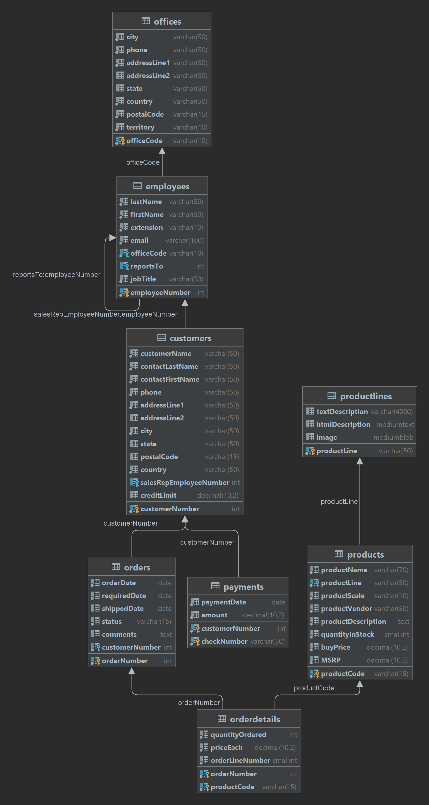

# Training Junior Programmer 3

1. Pelajari Modul SQL Query, dan Indexing;
2. Download MySQL Sample Database dari url berikut (https://www.mysqltutorial.org/mysql-sample-database.aspx) ;
3. Load sampel tersebut  ke database local MySQL anda;
4. Eksekusi script sql pada modul training (silahkan pilih beberapa dari tiap chapter yang dipelajari dengan penyesuaian terhadap sampel data yang sudah di load) dan jangan lupa screenshot;
5. Upload script dan screenshot tersebut ke github masing-masing;
6. Assign link github ke lokasi yang sudah disediakan
7. Submit!

### Diagram
